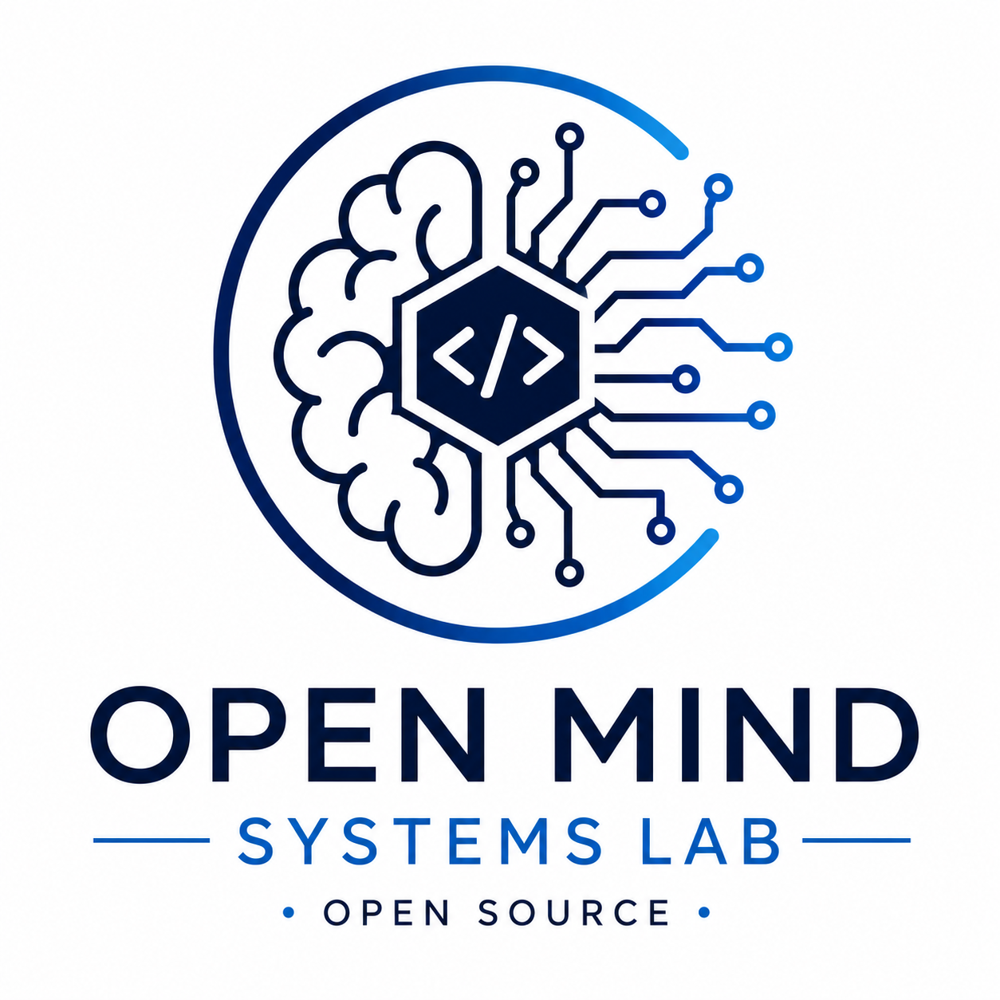

  

An independent Open Source Technology Lab dedicated to research,
experimental development and benchmarking.

---

**Current status**

- 📦 4 public repositories
- 🚀 4 published Proofs of Concept
- 📜 100% Open Source
- ⚖️ French Non-Profit Association (Loi 1901)

# 🎯 Mission

OpenMind Systems Lab is a French non-profit association (Association Loi 1901) dedicated to exploring modern software engineering through practical experimentation.

Our objective is to produce reusable Proofs of Concept (PoCs), technical benchmarks and educational material that anyone can study, reproduce and improve.

Research areas include:

- ☸️ Cloud Native & Kubernetes
- 📨 Distributed Messaging Systems
- 🔒 Infrastructure Security
- 📊 Performance Benchmarking
- 🤖 Artificial Intelligence & Model Context Protocol (MCP)
- ⚙️ Platform Engineering

---

# 📦 Projects

## ☸️ Kubernetes & Cloud Native

| Repository | Description |
|------------|-------------|
| [traefik-weight](https://github.com/openmind-systems-lab/traefik-weight) | Weighted Load Balancing with Traefik |
| [argocd-go-gitops](https://github.com/openmind-systems-lab/argocd-go-gitops) | GitOps deployment using Argo CD |
| [keda-go](https://github.com/openmind-systems-lab/keda-go) | Event-Driven Autoscaling with KEDA |

---

## 📨 Messaging

| Repository | Description |
|------------|-------------|
| [nats-jetstream-pipeline](https://github.com/openmind-systems-lab/nats-jetstream-pipeline) | Event-driven pipeline using NATS JetStream |

---

## 🔒 Security

| Planned Research | Description |
|------------------|-------------|
| Vault Local Lab | Local secrets management with HashiCorp Vault |
| External Secrets | Kubernetes external secret management |
| Open Policy Agent (OPA) | Policy-based authorization |
| Kyverno | Kubernetes policy management |

---

## 📊 Benchmark

| Planned Research | Description |
|------------------|-------------|
| Kafka vs NATS | Messaging performance comparison |
| RabbitMQ vs NATS | Messaging performance comparison |
| Traefik Benchmark | Ingress performance evaluation |
| KEDA Benchmark | Autoscaling performance analysis |

---

## 🤖 Artificial Intelligence

| Planned Research | Description |
|------------------|-------------|
| Ollama Local Lab | Local LLM experimentation |
| MCP Research | Model Context Protocol experiments |

---

# 🔬 Research Principles

Every project published by OpenMind Systems Lab follows the same principles:

- Open research
- Reproducibility
- Practical experimentation
- Transparent benchmarking
- Knowledge sharing
- Open Source by default

---

# 🚀 Roadmap

## Published

- ✅ traefik-weight
- ✅ argocd-go-gitops
- ✅ keda-go
- ✅ nats-jetstream-pipeline

## Next

- 🔄 vault-local-lab
- 🔄 mqtt-go
- 🔄 rabbitmq-go
- 🔄 kafka-go
- 🔄 pulsar-go

## Future Research

- OpenTelemetry
- Prometheus
- Grafana Loki
- Gateway API
- Cilium
- Linkerd
- External Secrets
- Open Policy Agent (OPA)
- Kyverno
- MCP
- Local AI

---

# 📜 Open Source

Unless explicitly stated otherwise, all projects are released under the MIT License.

Our objective is to maximize transparency, collaboration and knowledge sharing through permissive Open Source licensing.

---

# ⚖️ About

OpenMind Systems Lab is an independent French non-profit association (Association Loi 1901).

The organization is dedicated to:

- Research
- Experimental Development
- Technical Benchmarking
- Open Source Publication

The association operates independently from any commercial software vendor.

---

# 🤝 Contributing

Contributions, ideas and feedback are always welcome.

Feel free to:

- Open an Issue
- Submit a Pull Request
- Suggest a new Proof of Concept
- Propose a benchmark or research topic

---

OpenMind Systems Lab © 2026

