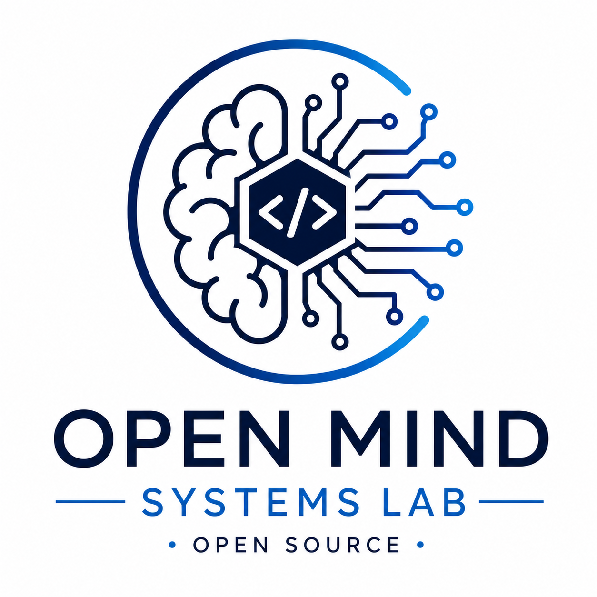

  

An independent Open Source Technology Lab dedicated to research,
experimental development and benchmarking.

---

## Current Status

- 📦 **15 public repositories**
- 🚀 **15 published Proofs of Concept**
- 📜 **100% Open Source**
- ⚖️ **French Non-Profit Association (Loi 1901)**

# 🎯 Mission

OpenMind Systems Lab is a French non-profit association (Association Loi 1901) dedicated to exploring modern software engineering through practical experimentation.

Our objective is to produce reusable Proofs of Concept (PoCs), technical benchmarks and educational material that anyone can study, reproduce and improve.

Research areas include:

- ☸️ Cloud Native & Kubernetes
- 📦 Kubernetes Native Storage & Data Platforms
- 🌐 Service Mesh & API Gateways
- 📨 Distributed Messaging Systems
- 🔒 Infrastructure Security
- 📊 Performance Benchmarking
- 🤖 Artificial Intelligence & Model Context Protocol (MCP)
- ⚙️ Platform Engineering
- 📦 OCI Artifacts & Container Image Distribution

---

# 📦 Projects

## ☸️ Cloud Native

| Repository | Description |
|------------|-------------|
| [traefik-weight](https://github.com/openmind-systems-lab/traefik-weight) | Weighted Load Balancing with Traefik |
| [envoy-gateway-playground](https://github.com/openmind-systems-lab/envoy-gateway-playground) | Kubernetes Gateway API with Envoy Gateway |
| [istio-playground](https://github.com/openmind-systems-lab/istio-playground) | Service Mesh fundamentals with Istio |
| [argocd-go-gitops](https://github.com/openmind-systems-lab/argocd-go-gitops) | GitOps deployment using Argo CD |
| [keda-go](https://github.com/openmind-systems-lab/keda-go) | Event-Driven Autoscaling with KEDA |
| [image-volume-playground](https://github.com/openmind-systems-lab/image-volume-playground) | Kubernetes Image Volume experimentation using OCI images |

---

## 📦 Storage

| Repository | Description |
|------------|-------------|
| [kubernetes-native-storage-playground](https://github.com/openmind-systems-lab/kubernetes-native-storage-playground) | Kubernetes Native Storage fundamentals, PersistentVolumes, PersistentVolumeClaims and CSI concepts |
| [kubernetes-volume-snapshot-playground](https://github.com/openmind-systems-lab/kubernetes-volume-snapshot-playground) | Kubernetes CSI Volume Snapshots, point-in-time snapshots and volume restoration |
| [kubernetes-statefulset-playground](https://github.com/openmind-systems-lab/kubernetes-statefulset-playground) | Kubernetes StatefulSets, stable identities, Headless Services and persistent storage |

---

## 📨 Messaging

| Repository | Description |
|------------|-------------|
| [nats-jetstream-pipeline](https://github.com/openmind-systems-lab/nats-jetstream-pipeline) | Distributed messaging with NATS JetStream |
| [mqtt-k8s-playground](https://github.com/openmind-systems-lab/mqtt-k8s-playground) | MQTT messaging on Kubernetes using Eclipse Mosquitto |

---

## 🔒 Security

| Repository | Description |
|------------|-------------|
| [hashicorp-vault-python](https://github.com/openmind-systems-lab/hashicorp-vault-python) | Secret injection using HashiCorp Vault Agent Injector |
| [external-secrets-operator](https://github.com/openmind-systems-lab/external-secrets-operator) | Kubernetes External Secrets Operator |
| [kyverno-playground](https://github.com/openmind-systems-lab/kyverno-playground) | Kubernetes policy management with Kyverno |
| [spire-k8s-playground](https://github.com/openmind-systems-lab/spire-k8s-playground) | SPIRE on Kubernetes using the modern CRD-based model |

---

## 📊 Upcoming Research

| Planned Research | Description |
|------------------|-------------|
| Kafka vs NATS | Messaging performance comparison |
| RabbitMQ vs NATS | Messaging performance comparison |
| MQTT vs NATS | Messaging performance comparison |
| Traefik Benchmark | Ingress performance evaluation |
| KEDA Benchmark | Autoscaling performance analysis |

---

## 🤖 Artificial Intelligence

| Planned Research | Description |
|------------------|-------------|
| Ollama Local Lab | Local LLM experimentation |
| MCP Research | Model Context Protocol experiments |

---

# 🔬 Research Principles

Every project published by OpenMind Systems Lab follows the same principles:

- Open research
- Reproducibility
- Practical experimentation
- Transparent benchmarking
- Knowledge sharing
- Open Source by default

---

# 🚀 Roadmap

## Published

- ✅ traefik-weight
- ✅ envoy-gateway-playground
- ✅ istio-playground
- ✅ argocd-go-gitops
- ✅ keda-go
- ✅ nats-jetstream-pipeline
- ✅ mqtt-k8s-playground
- ✅ hashicorp-vault-python
- ✅ external-secrets-operator
- ✅ kyverno-playground
- ✅ spire-k8s-playground
- ✅ image-volume-playground
- ✅ kubernetes-native-storage-playground
- ✅ kubernetes-volume-snapshot-playground
- ✅ kubernetes-statefulset-playground

## Next

- 🔄 rabbitmq-k8s-playground
- 🔄 kafka-k8s-playground
- 🔄 pulsar-k8s-playground
- 🔄 ollama-playground
- 🔄 longhorn-playground
- 🔄 rook-ceph-playground
- 🔄 velero-playground

## Future Research

- OpenTelemetry
- Cilium
- Linkerd
- Open Policy Agent (OPA)
- Prometheus
- Grafana Loki
- MCP
- Local AI
- OCI Artifact Distribution
- Kubernetes Native Storage Patterns
- Immutable Application Assets

---

# 📜 Open Source

Unless explicitly stated otherwise, all projects are released under the MIT License.

Our objective is to maximize transparency, collaboration and knowledge sharing through permissive Open Source licensing.

---

# ⚖️ About

OpenMind Systems Lab is an independent French non-profit association (Association Loi 1901).

The organization is dedicated to:

- Applied Research
- Experimental Development
- Technical Benchmarking
- Knowledge Sharing
- Open Source Publication

The association operates independently from any commercial software vendor.

---

# 🤝 Contributing

Contributions, ideas and feedback are always welcome.

Feel free to:

- Open an Issue
- Submit a Pull Request
- Suggest a new Proof of Concept
- Propose a benchmark or research topic

---

Made with ❤️ by OpenMind Systems Lab

